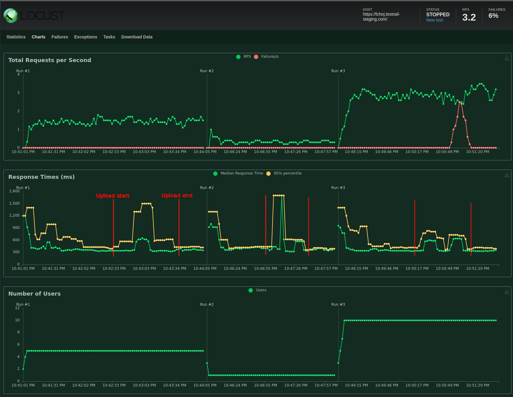
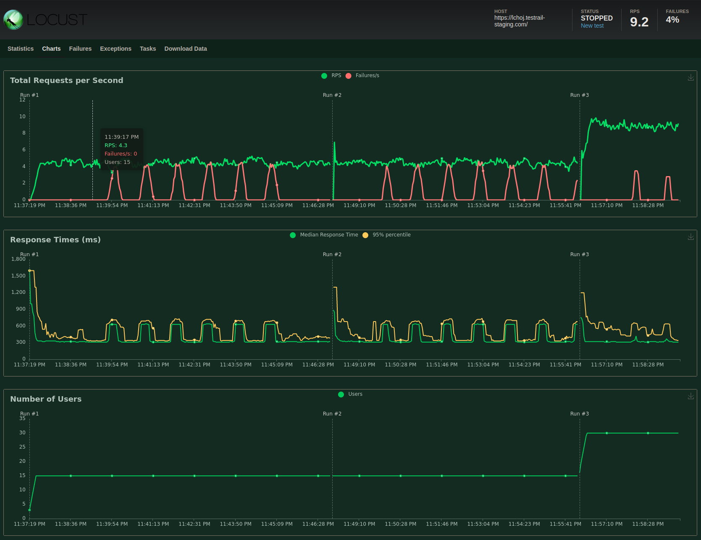
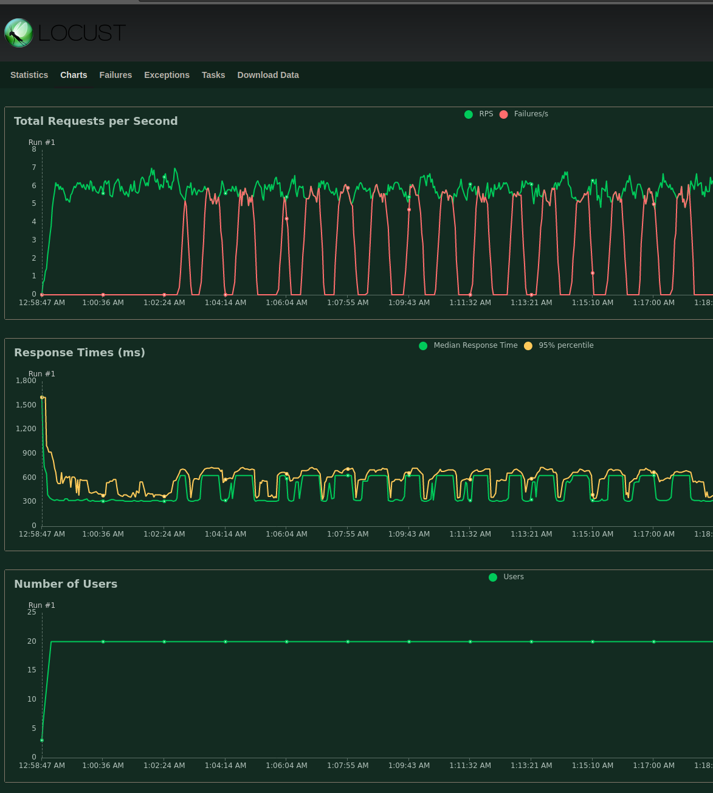

#Usage description
**To run locust**:

`locust -f testrail_stress.py --user "YOUR_USER_HERE" --password "PASS_OR_API_KEY"`

**To generate xml file** for test upload just modify `xml_generator.py` according to your needs and run it.
#Performance tests results

All runs simulated using TRCLI tool uploading 400 test cases. With setting `MAX_WORKERS_ADD_CASE = 10`

- Run #1 simulated with 5 users
- Run #2 simulated with 1 user
- Run #3 simulated with 10 users

Didn't observe any unusual behaviour. Some peaks in response times for locust users are visible during TRCLI upload but no errors occured.
429 errors are visible in last run but this error occured becouse of API rate limit.

All runs simulated using TRCLI tool uploading 2000 test cases. With setting `MAX_WORKERS_ADD_CASE = 5`

- Run #1 simulated with 10 users with successfully passed 2000 test cases
- Run #2 simulated with 10 user with error 2000 test cases with error payload
- Run #3 simulated with 30 users TRCLI not run

Didn't observe any unusual behaviour. Some peaks in response times for locust users are visible during TRCLI upload but no errors occured.
429 errors are visible in last run but this error occured becouse of API rate limit.
During last run the decision was to stop the tests because 429 errors occured without using TRCLI so there is no point to push API further.

Run was simulated with 20 users with 5000 failed test cases with error payload. Upload in this condition took 1000 seconds (16 min).
We observed that time for upload is similar without locust load.
Didn't observe any unusual behaviour. As we are reaching the limit of API in staging instance, there is no point to push tests further.